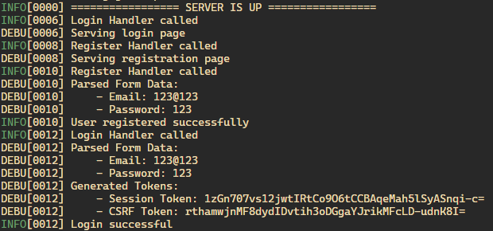
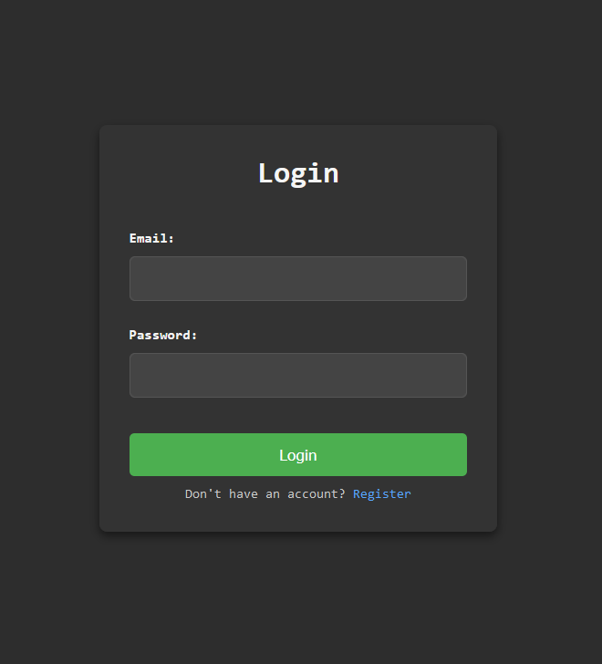
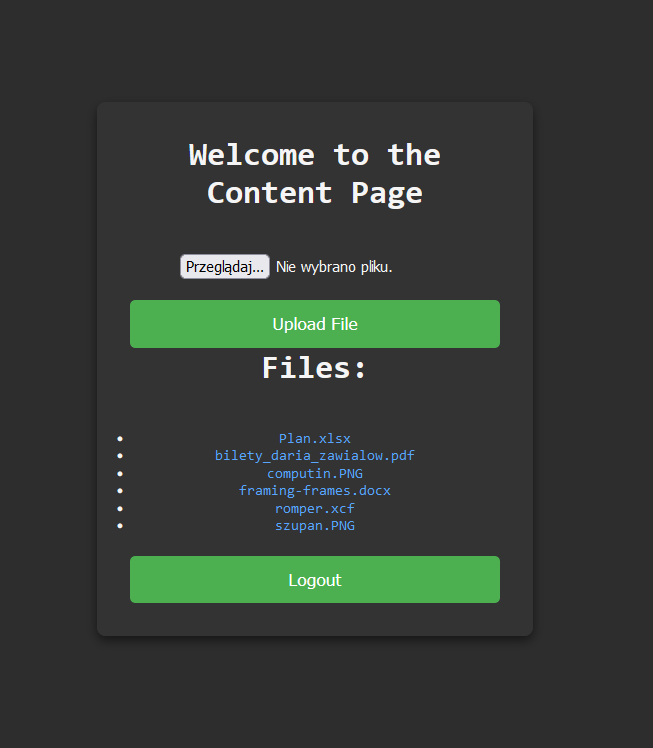
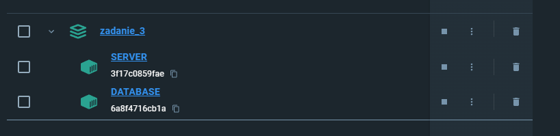

# 📚 README

## 📑 Nawigacja

- [Zadanie 1: Skonteneryzowanie prostego serwisu](#zadanie-1-skonteneryzowanie-prostego-serwisu)
- [Zadanie 2: Konfiguracja i uruchomienie kontenera z bazą danych](#zadanie-2-konfiguracja-i-uruchomienie-kontenera-z-bazą-danych)
- [Zadanie 3: Zapis plików do wolumenu i pełna integracja bazy z aplikacją](#zadanie-3-zapis-plików-do-wolumenu-i-pełna-integracja-bazy-z-aplikacją)
- [Przydane komendy](#przydane-komendy)

---

## 📌 Wstęp

Całość plików potrzebnych do zadania znajduje się na branchu `zadania`.

Zalecamy korzystanie z **Docker Desktop** – ułatwia to zrozumienie podstawowych konceptów oraz zarządzanie środowiskiem, ale istnieje także możliwość pracy wyłącznie z pomocą terminala i samego **Docker Engine**.

---

### ℹ️ Pomoc

Jeśli napotkasz trudności w trakcie realizacji któregokolwiek z zadań, w folderze **help** znajdziesz podpowiedzi, które pomogą Ci krok po kroku rozwiązać problem i ukończyć zadanie.

---

## ⚙️ Instalacja środowiska Docker

Tą część można pominąć, jeśli masz już zainstalowanego Dockera.

- **Windows**: [Instalacja Docker Desktop na Windows](https://docs.docker.com/desktop/setup/install/windows-install/)
- **Linux**:
  - Sam Docker Engine: [Instalacja Docker Engine na Linux](https://docs.docker.com/engine/install/)
  - Docker Desktop: [Instalacja Docker Desktop na Linux](https://docs.docker.com/desktop/setup/install/linux/)
- **Mac**: [Instalacja Docker Desktop na Mac](https://docs.docker.com/desktop/setup/install/mac-install/)

Upewnij się, że środowisko działa poprawnie, np. poprzez:

```bash
docker --version
```

---

<br>
<br>

# Zadanie 1: Skonteneryzowanie prostego serwisu

### a) Kontekst:

Otrzymujesz prosty HTTP web server, który:

- Do komunikacji używa portu **8080**.
- Implementuje prosty system uwierzytelnienia, a wszystkie dane są zapisywane w pliku `userData.json`.
- Umożliwia użytkownikom upload ich personalnych plików. W mocno okrojonej wersji wszystkie pliki trafiają do folderu `/uploads`.
- Serwis do prawidłowej pracy potrzebuje skompilowanych plików `go`, katagolu `/uploads`, katalogu `/static` oraz pliku `userData.json`

### b) Twoje zadanie:

1. Napisz prosty plik `Dockerfile`, który umożliwi uruchomienie aplikacji w kontenerze.
2. Aplikacja w kontenerze powinna zachować pełną funkcjonalność, w tym:
   - Tworzenie użytkowników.
   - Logowanie użytkowników.
   - Uploadowanie plików do lokalnego folderu.
3. Postaraj się, aby twój `Dockerfile` tworzył użytkownika **nieuprzywilejowanego**, by zapewnić większe bezpieczeństwo serwisu.

## 📝 Podstawowe komendy w Dockerfile

      Określanie obrazu bazowego, z którego będzie budowany nasz obraz.
      FROM <image_name>:<tag>

      Wykonywanie polecenia w trakcie budowania obrazu. Może to być instalowanie zależności, uruchamianie skryptów...
      RUN <command>

      Kopiowanie plików lub katalogów z lokalnego systemu plików do kontenera.
      COPY <source_path> <destination_path>

      Dodawanie plików lub katalogów, podobnie jak COPY, ale z dodatkowymi funkcjami (np. rozpakowywanie archiwów tar).
      ADD <source_path> <destination_path>

      Ustawianie bieżącego katalogu roboczego, w którym będą wykonywane następne komendy.
      WORKDIR <directory_path>

      Określanie domyślnej komendy, która będzie wykonana, gdy kontener zostanie uruchomiony.
      CMD ["executable", "param1", "param2"]

      Definiowanie głównego procesu, który będzie uruchomiony w kontenerze, i może być używane razem z CMD w celu przekazania argumentów.
      ENTRYPOINT ["executable", "param1"]

      Informowanie Docker, że kontener nasłuchuje na określonym porcie. Tylko dokumentacja, nie otwiera portu.
      EXPOSE <port>

      Ustawianie zmiennych środowiskowych w kontenerze.
      ENV <key> <value>

      Tworzenie punktu montowania, który umożliwia przechowywanie danych poza kontenerem.
      VOLUME ["<mount_point>"]

      Określanie użytkownika, na którego będzie działał kontener.
      USER <username>

---

## c) Wynik:

Najlepiej pokaż screeny z:

1. Komendą uruchamiającą kontener np:
   ```bash
   docker run --name zadanie_1_kontener -p 8080:8080 zadanie_1_image
   ```
2. Logami aplikacji, gdzie widać:
   - Utworzenie nowego użytkownika.
   - Zalogowanie się tego użytkownika.
   - Upload jakiegoś pliku.

**Logi powinny wyglądać mniej więcej tak:**



**Uruchomiona aplikacja powinna wyglądać tak:**



---

<br>
<br>

# Zadanie 2: Konfiguracja i uruchomienie kontenera z bazą danych

### a) Kontekst:

Musisz rozszerzyć serwis o połączenie z niezależną bazą danych. Zamiast w pliku `userData.json`, dane użytkowników będą przechowywane w tej bazie. Aplikacja jest już skonfigurowana do komunikacji z bazą danych na porcie **3306**. (patrz: `services/db.go`)

### b) Twoje zadanie:

1. **Uruchom kontener bazy danych**: Przygotuj plik `docker-compose.yaml`, korzystając z gotowego obrazu dostępnego w [Docker Hub](https://hub.docker.com/) (np. `mysql`, `postgres` lub innego). Skonfiguruj porty i ustawienia umożliwiające połączenie z aplikacją.
2. **Skonfiguruj bazę danych**: Zdefiniuj zmienne środowiskowe dla użytkownika, hasła i nazwy bazy, aby aplikacja mogła się z nią połączyć.

   > UWAGA: Aplikacja jest przygotowana pod nazwę `auth_server_db` (patrz plik `services/db.go`).

3. **Health check dla kontenera bazy danych**: Dodaj mechanizm **health check** w `docker-compose.yaml`, aby upewnić się, że baza danych działa i jest gotowa do użycia. Zaimplementuj mechanizm ponawiania uruchamiania aplikacji, dopóki baza danych nie będzie gotowa.
4. **Wykonanie zapytania SQL**: Po uruchomieniu bazy danych, dodaj użytkownika przez aplikację i wykonaj zapytanie SQL, np.:
   ```sql
   SELECT * FROM users;
   ```

### Przykładowy plik docker-compose.yml

    version: '3.8' # Wersja składni Docker Compose
    
    services: 
      app: # Nazwa usługi
        image: node:16 # Obraz Docker
        container_name: app-container # Nazwa kontenera
        build: 
          context: ./app # Ścieżka do katalogu projektu
          dockerfile: Dockerfile # Nazwa pliku Dockerfile
        ports:
          - "3000:3000" # Mapowanie portów host:kontener
        volumes:
          - ./app:/usr/src/app # Mapowanie woluminów lokalnych na kontener
        environment: 
          NODE_ENV: development # Przykładowa zmienna środowiskowa
    
      database:
        image: mysql:8.0 # Obraz bazy danych MySQL
        container_name: mysql-container # Nazwa kontenera
        ports:
          - "3306:3306" # Mapowanie portów host:kontener
        environment: 
          MYSQL_ROOT_PASSWORD: rootpassword # Hasło użytkownika root
          MYSQL_DATABASE: mydatabase # Nazwa bazy danych
          MYSQL_USER: user # Nazwa użytkownika
          MYSQL_PASSWORD: password # Hasło użytkownika
        volumes:
          - db-data:/var/lib/mysql # Wolumin do przechowywania danych
    
    volumes:
      db-data: # Definicja woluminu

## c) Wynik:

- Zrzut ekranu z **aktywnymi kontenerami**, pokazujący działanie aplikacji i bazy danych (Docker Desktop albo komenda: `docker ps`).
- Zrzut ekranu, który pokazuje, że użytkownik został dodany do bazy danych (patrz zapytanie SQL powyżej).

---

<br>
<br>

# Zadanie 3: Zapis plików do wolumenu i pełna integracja bazy z aplikacją

### a) Kontekst:

Aplikacja jest przygotowana tak, aby pliki uploadowane przez użytkowników były zapisywane w katalogu `/shared-data`. Serwer automatycznie tworzy tam odpowiednie foldery, jeśli nie istnieją.

### b) Twoje zadanie:

1. Przerób plik `docker-compose.yaml`, aby zdefiniować wolumen umożliwiający przechowywanie plików użytkowników w katalogu `shared-data`.
2. Zmodyfikuj wcześniejszy `Dockerfile`, aby aplikacja miała odpowiednie uprawnienia do tworzenia katalogów i zapisywania plików w wolumenie `shared-data`.
3. Upewnij się, że:
   - Dane użytkowników są poprawnie zapisywane w bazie danych.
   - Pliki użytkowników są przechowywane w odpowiednich katalogach w wolumenie.
4. Poprzez interfejs aplikacji:
   - Stwórz użytkownika.
   - Zaloguj się.
   - Zuploaduj plik.

> **Aplikacja powinna wyświetlać listę uploadowanych plików per user. Kliknięcie pliku powinno otworzyć go w nowej karcie lub automatycznie go pobrać.**



> **Struktura w Docker Desktop powinna wyglądać następująco:**

### Images:


### Containers:



## c) Wynik:

- Dołącz screeny pokazujące, że pliki użytkowników są przechowywane w odpowiednich katalogach w udostępnionym wolumenie. Możesz to sprawdzić za pomocą Docker Desktop lub komendy: `docker volume inspect <volume_name>`.

---

## Przydane komendy:

- **Pokaż wszystkie kontenery (działające i zatrzymane):**

  ```bash
  docker ps -a
  ```

- **Uruchom interaktywną sesję w kontenerze bazy danych:**

  ```bash
  docker exec -it DATABASE mysql -u admin -p
  ```

- **Lista wszystkich wolumenów Docker:**

  ```bash
  docker volume ls
  ```

- **Sprawdź szczegóły konkretnego wolumenu:**

  ```bash
  docker volume inspect VOLUME_NAME
  ```

- **Wyświetl logi kontenera:**

  ```bash
  docker logs CONTAINER_NAME
  ```

- **Uruchom zatrzymany kontener:**

  ```bash
  docker start CONTAINER_NAME
  ```

- **Zatrzymaj działający kontener:**

  ```bash
  docker stop CONTAINER_NAME
  ```

- **Usuń zatrzymany kontener:**

  ```bash
  docker rm CONTAINER_NAME
  ```

- **Pokaż wszystkie obrazy:**

  ```bash
  docker images
  ```

- **Usuń obraz po nazwie/id:**

  ```bash
  docker rmi IMAGE_NAME
  ```

- **Usuń nieużywane obrazy, wolumeny i kontenery:**

  ```bash
  docker system prune -a
  ```

- **Sprawdź szczegóły działających kontenerów:**

  ```bash
  docker stats
  ```

- **Wejdź do powłoki w kontenerze aplikacji:**

  ```bash
  docker exec -it APP_CONTAINER /bin/sh
  ```

- **Sprawdź przestrzeń dyskową zajmowaną przez Docker:**
  ```bash
  docker system df
  ```
